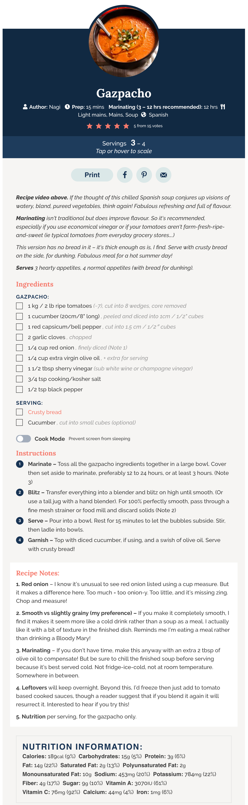
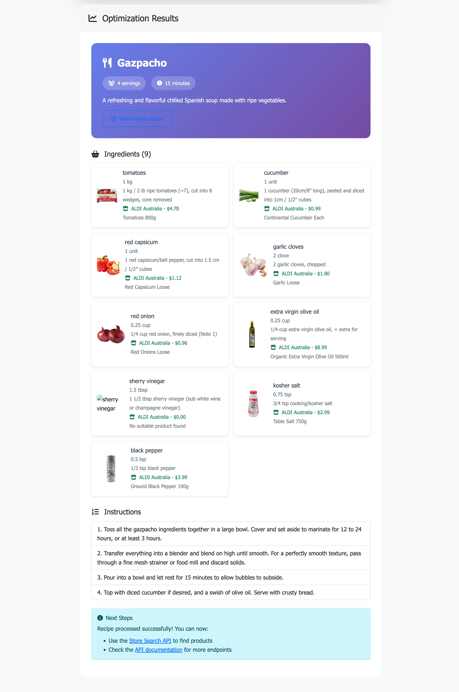
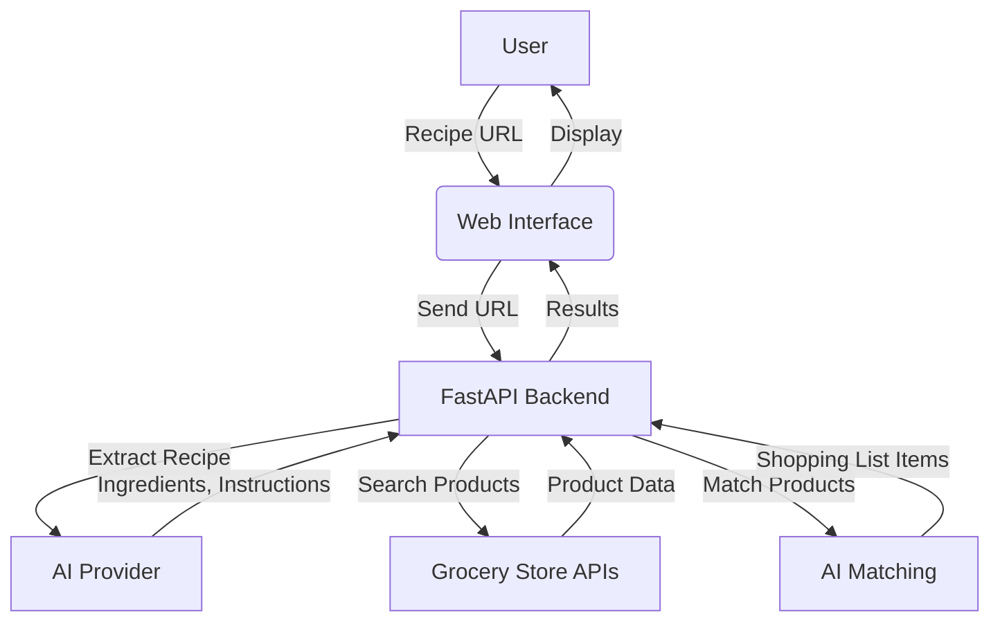

# AI Recipe Shoplist 🤖🛒

AI Recipe Shoplist is an intelligent Python 3.11+ application that analyzes recipe websites, extracts ingredients using AI, and searches multiple grocery stores for matching products. It demonstrates AI-powered recipe analysis with real-world grocery store integration and a modern web interface.

> **📋 Note**: This project uses modern Python tooling with `uv` for fast dependency management and includes a comprehensive web interface with clickable product links.

## 🚀 Features

- 🤖 **AI-Powered Recipe Extraction**: Uses OpenAI, Azure OpenAI, Ollama, or GitHub Models to intelligently parse recipe websites
- 🛒 **Multi-Store Product Search**: Searches Coles and ALDI with real product URLs
- 🔗 **Clickable Product Links**: Direct links to grocery store products for easy shopping
- 🧠 **Smart Product Matching**: AI-enhanced ingredient matching with store-specific product catalogs
- 🌐 **Modern Web Interface**: FastAPI-based application with responsive design and demo functionality
- ⚡ **Fast Dependencies**: Uses `uv` for lightning-fast dependency management and virtual environments
- ⚙️ **Type-Safe Configuration**: Pydantic-based configuration with validation and type checking
- 🔄 **Robust Error Handling**: Automatic retry logic with exponential backoff
- 📊 **Comprehensive Logging**: Structured logging with configurable levels and file output
- 💾 **Advanced Storage System**: Multi-format async storage with JSON, Pickle, and Joblib support
- 🎯 **Demo Mode**: Try the app with sample gazpacho recipe data from real ALDI products

> � **[Storage System Documentation](docs/storage-system.md)**: Comprehensive guide to the async storage architecture, including BlobManager, CacheManager, and StorageManager with usage examples and best practices.

## 📱 Application Screenshots

### Initial Recipe Input Form
<div align="center">
   
</div>

*The main interface where users enter a recipe URL to begin the ingredient extraction process.*

### Example Recipe - Gazpacho
<div align="center">
   
</div>

*Example recipe processing using [Gazpacho from RecipeTin Eats](https://www.recipetineats.com/gazpacho/) - demonstrating AI-powered ingredient extraction from recipe websites.*

### Search Results Display
<div align="center">
   
</div>

*Results showing extracted ingredients and matched products from various grocery stores.*

## 🏗️ Architecture

```
ai-recipe-shoplist/
├── app/
│   ├── __init__.py
│   ├── main.py                     # FastAPI application setup & routing
│   ├── models.py                   # Pydantic data models
│   ├── api/
│   │   ├── __init__.py            # API package initialization
│   │   └── v1.py                  # API v1 endpoints (versioned API)
│   ├── client/
│   │   └── ai_chat_client.py       # AI chat client implementation
│   ├── config/
│   │   ├── pydantic_config.py      # Type-safe configuration management
│   │   ├── logging_config.py       # Logging configuration
│   │   └── store_config.py         # Store configuration management
│   ├── services/
│   │   ├── ai_service.py           # AI provider management
│   │   ├── web_fetcher.py          # Web content fetching
│   │   ├── web_data_service.py     # Web data processing
│   │   ├── grocery_service.py      # Grocery store management
│   │   └── store_crawler.py        # Store crawling services
│   ├── storage/                    # Storage system (see docs/storage-system.md)
│   │   ├── blob_manager.py         # Async blob storage management
│   │   ├── cache_manager.py        # Memory cache management
│   │   └── storage_manager.py      # Unified storage operations
│   ├── ia_provider/
│   │   ├── base_provider.py        # Base AI provider class
│   │   ├── openai_provider.py      # OpenAI implementation
│   │   ├── azure_provider.py       # Azure OpenAI implementation
│   │   ├── ollama_provider.py      # Ollama implementation
│   │   ├── github_provider.py      # GitHub Models implementation
│   │   └── stub_provider.py        # Stub implementation for testing
│   ├── scrapers/
│   │   └── html_content_extractor.py  # HTML content extraction & processing
│   ├── templates/
│   │   └── index.html             # Web interface template
│   ├── static/
│   │   ├── style.css              # Styling
│   │   ├── app.js                 # Main frontend JavaScript
│   │   └── demo.js                # Demo functionality (extracted)
│   └── utils/
│       ├── ai_helpers.py          # AI utility functions
│       ├── html_helpers.py        # HTML processing utilities
│       └── str_helpers.py         # String processing utilities
├── docs/
│   ├── img/                       # Documentation images
│   ├── storage-system.md          # Storage system documentation
│   ├── configuration.md           # Configuration documentation
│   └── troubleshooting.md         # Troubleshooting guide
├── stub_responses/                # Mock AI responses for testing
├── tests/                         # Test suite
├── .env                          # Environment configuration
├── pyproject.toml               # Project configuration and dependencies
├── uv.lock                     # Lock file for reproducible builds (generated by uv)
├── start.sh                     # Startup script
└── README.md                    # This file
```

## 🔍 How it Works 

This project is an intelligent web application that uses AI to analyze recipes, extract ingredients, and find matching products from multiple grocery stores. It combines Python backend services, AI providers, and a modern frontend to deliver a seamless shopping experience.

### System Overview

1. **User Input**: The user enters a recipe URL in the web interface.
2. **AI Extraction**: The backend uses an AI provider (OpenAI, Azure, Ollama, or GitHub Models) to intelligently extract ingredients, quantities, and instructions from the recipe webpage.
3. **Store Search**: The system queries configured grocery stores (Coles, Woolworths, ALDI, IGA) for products matching each ingredient.
4. **Product Matching**: AI matches extracted ingredients with available store products, considering price, quantity, and relevance.
5. **Results Display**: The frontend displays matched products, clickable store links, and a shopping list for the user.
6. **Demo Mode**: Users can try a demo with a sample recipe and real product data.

### Architecture Diagram



### Data Flow

1. **Input**: User provides a recipe URL.
2. **AI Extraction**: Backend sends the URL to the AI provider, which returns structured recipe data.
3. **Store Search**: For each ingredient, the backend queries store APIs or scrapers for matching products.
4. **Product Matching**: AI logic selects the best product for each ingredient.
5. **Frontend Display**: Results are shown in a responsive web interface, with direct links to products.

### Key Components

- **FastAPI Backend**: Handles API requests, recipe extraction, product search, and business logic.
- **AI Providers**: Extract recipe data and assist in product matching.
- **Grocery Store Integrations**: Search for products in real stores.
- **Frontend (HTML/JS)**: User interface for input and results.
- **Storage System**: Caches and stores data for performance and reliability.

### Example Workflow

1. User enters a recipe URL and clicks "Process Recipe".
2. Backend extracts ingredients using AI.
3. Backend searches stores for matching products.
4. AI matches products to ingredients.
5. Frontend displays shopping list with product links.

## 🛠️ Installation

### Prerequisites

- **Python 3.11+**
- **uv** (recommended) or **pip** 
- One of the AI providers configured (see AI Provider Setup below)

### Quick Start

1. **Clone and navigate to the project:**
   ```bash
   cd ai-recipe-shoplist
   ```

2. **Install dependencies:**

   **Option A: Using uv (recommended - fastest):**
   ```bash
   # Install uv if not already installed
   curl -LsSf https://astral.sh/uv/install.sh | sh
   source $HOME/.local/bin/env

   # Sync all dependencies (creates virtual environment automatically)
   uv sync
   ```

   **Option B: Traditional pip installation:**
   ```bash
   python3.11 -m venv .venv
   source .venv/bin/activate  # On Windows: .venv\Scripts\activate
   pip install --upgrade pip
   pip install -e .
   ```

4. **Configure AI provider:**
   ```bash
   # Create environment file
   cp .env.example .env     # If available, or create new .env file

   # Edit .env with your credentials
   nano .env
   ```

5. **Run the application:**
   
   **Option A: Using the startup script (recommended):**
   ```bash
   chmod +x start.sh
   ./start.sh
   ```
   
   **Option B: Direct command with uv:**
   ```bash
   uv run uvicorn app.main:app --reload --host 0.0.0.0 --port 8000
   ```
   
   **Option C: Traditional uvicorn (if using pip):**
   ```bash
   # Activate virtual environment first
   source .venv/bin/activate
   uvicorn app.main:app --reload --host 0.0.0.0 --port 8000
   ```

6. **Open your browser:**
   - **Web Interface:** http://localhost:8000
   - **API Documentation:** http://localhost:8000/api/v1/docs
   - **API Re-Documentation:** http://localhost:8000/api/v1/redoc

### 🎯 Try the Demo

Once the application is running, you can try the demo functionality:

1. **Web Interface Demo**: Visit http://localhost:8000 and click the "Try Demo" button
2. **API Demo**: `curl -X GET "http://localhost:8000/api/v1/demo"`

The demo loads a real gazpacho recipe with actual ALDI product data, showcasing:
- ✅ Ingredient extraction and parsing
- ✅ Product matching with real URLs
- ✅ Multi-store integration (ALDI example)
- ✅ Clickable product links for easy shopping

### Using the Startup Script

The included `start.sh` script provides additional benefits:

- **Smart Package Management**: Automatically installs `uv` if not present and syncs dependencies
- **Configuration validation**: Validates your `.env` file before starting
- **Directory creation**: Creates required directories (logs, cache, etc.)
- **Provider checking**: Verifies AI provider connectivity (e.g., Ollama)
- **Flexible configuration**: Reads server host/port from environment variables

```bash
chmod +x start.sh
./start.sh
```

The script now uses `uv` for faster dependency management while maintaining compatibility with traditional pip installations.

## 🤖 AI Provider Setup

### OpenAI

1. Get API key from [OpenAI Platform](https://platform.openai.com/api-keys)
2. Create or edit your `.env` file
3. Set your API key:
   ```env
   OPENAI_API_KEY=sk-your-openai-api-key-here
   AI_PROVIDER=openai
   ```

### Azure OpenAI

1. Create Azure OpenAI resource in [Azure Portal](https://portal.azure.com/)
2. Deploy a model (e.g., gpt-4o-mini)
3. Create or edit your `.env` file
4. Configure:
   ```env
   AZURE_OPENAI_API_KEY=your-azure-key
   AZURE_OPENAI_ENDPOINT=https://your-resource.openai.azure.com/
   AZURE_OPENAI_DEPLOYMENT_NAME=your-deployment-name
   AI_PROVIDER=azure
   ```

### Ollama (Local)

1. Install Ollama:
   ```bash
   curl -fsSL https://ollama.ai/install.sh | sh
   ```

2. Start Ollama and pull a model:
   ```bash
   ollama serve
   ollama pull llama3.1
   ```

3. Create or edit your `.env` file
4. Configure:
   ```env
   OLLAMA_HOST=http://localhost:11434
   OLLAMA_MODEL=llama3.1
   AI_PROVIDER=ollama
   ```

### GitHub Models

1. Request access at [GitHub Models](https://github.com/marketplace/models)
2. Create Personal Access Token with `repo` scope
3. Create or edit your `.env` file
4. Configure:
   ```env
   GITHUB_TOKEN=ghp_your-token-here
   GITHUB_MODEL=gpt-4o-mini
   AI_PROVIDER=github
   ```

## 🌐 Usage

### Web Interface

1. **Navigate to http://localhost:8000**
2. **Enter a recipe URL** from supported sites:
   - AllRecipes.com
   - Food.com  
   - BBC Good Food
   - Any recipe site with structured data
3. **Click "Process Recipe"** to extract ingredients using AI
4. **Review extracted ingredients** and search for products in grocery stores
5. **View product matches** across different stores

### API Endpoints

The application provides a RESTful API with **versioned endpoints** for better maintainability and backward compatibility:

#### API v1 Endpoints (`/api/v1/`)
- `GET /` - Web interface
- `GET /health` - Health check endpoint
- `POST /api/v1/process-recipe-ai` - AI-powered recipe processing with shopping plan generation
- `POST /api/v1/search-stores` - Search grocery stores for specific ingredients
- `POST /api/v1/fetcher` - Get web content fetching details
- `GET /api/v1/fetcher-stats` - Get web fetcher cache statistics
- `POST /api/v1/clear-fetcher-cache` - Clear the web fetcher cache
- `POST /api/v1/clear-content-files` - Clear saved content files
- `GET /api/v1/demo` - Load demo recipe data

#### API Documentation
- `GET /api/v1/docs` - Interactive API documentation (Swagger UI)
- `GET /api/v1/redoc` - Alternative API documentation (ReDoc)

#### Legacy Support
- Legacy `/api/*` endpoints automatically redirect to `/api/v1/*` for backward compatibility
- `GET /api/docs` → Redirects to `/api/v1/docs`
- `GET /api/redoc` → Redirects to `/api/v1/redoc`

### Current Functionality

The application currently provides:

1. **Recipe Processing**: Extract ingredients from recipe URLs using AI
2. **Store Integration**: Connect with multiple grocery store configurations (Coles, Woolworths, ALDI, IGA)
3. **Product Matching**: Use AI to match extracted ingredients with store products
4. **Web Interface**: User-friendly interface for recipe input and result display

### Demo Mode

Try the demo with a sample recipe using the v1 API:
```bash
curl -X GET "http://localhost:8000/api/v1/demo"
```

Or use the web interface for an interactive experience.

## 🔧 Configuration

The application uses **Pydantic Settings** for comprehensive type-safe configuration management with automatic environment variable loading and validation.

> 📖 **[Configuration Documentation](docs/configuration.md)**: Complete configuration guide including environment variables, AI provider setup, security best practices, performance tuning, and environment-specific configurations.

### Quick Configuration

Create a `.env` file in the project root with your basic configuration:

```env
# AI Provider (required)
AI_PROVIDER=openai                    # Options: openai, azure, ollama, github
OPENAI_API_KEY=sk-your-openai-key     # Your OpenAI API key

# Server Configuration (optional)
SERVER_HOST=0.0.0.0                  # Default: 0.0.0.0
SERVER_PORT=8000                     # Default: 8000

# Logging (optional)
LOG_LEVEL=INFO                       # Options: DEBUG, INFO, WARNING, ERROR
```

For complete configuration options, security considerations, and environment-specific setups, see the [detailed configuration documentation](docs/configuration.md).

## 🧪 Development

### Development with uv (Recommended)

```bash
# Install development dependencies
uv sync --group dev

# Run tests
uv run pytest tests/ -v

# Code formatting
uv run black app/ tests/
uv run isort app/ tests/

# Type checking
uv run mypy app/

# Run application in development mode
uv run uvicorn app.main:app --reload
```

### Development with pip (Alternative)

```bash
# Activate virtual environment
source .venv/bin/activate

# Install development dependencies
pip install -e ".[dev]"

# Run tests
pytest tests/ -v

# Code formatting
black app/ tests/
isort app/ tests/

# Type checking
mypy app/
```

### Why uv?

- **⚡ 10-100x faster** than pip for dependency resolution and installation
- **🔒 Reproducible builds** with automatic `uv.lock` generation
- **🛠️ Built-in virtual environment management** - no need to create `.venv` manually
- **🔄 Compatible** with existing pip/PyPI ecosystem
- **📦 Modern Python tooling** designed for Python 3.8+ projects

### Adding New Features

1. **New API Endpoints**: Add to `app/api/v1.py` for current API or create `app/api/v2.py` for new API version
2. **New Recipe Sites**: Extend web fetching and parsing in `web_data_service.py` and `html_content_extractor.py`
3. **New AI Providers**: Implement `BaseAIProvider` in `ia_provider/` directory
4. **New Configuration**: Add settings to `pydantic_config.py` with proper validation
5. **New Services**: Create new services in `services/` directory with proper logging
6. **New Stores**: Add store configurations in `config/store_config.py`
7. **API Versioning**: For breaking changes, create new API version in `app/api/v2.py`
8. **Storage Components**: Add new storage managers in `storage/` directory with async operations (see [Storage System Documentation](docs/storage-system.md))
9. **Serialization Formats**: Extend `BlobManager` with new serialization formats as needed
10. **Configuration**: Add new settings to `pydantic_config.py` with proper validation (see [Configuration Documentation](docs/configuration.md))

### Development Guidelines

See the comprehensive documentation for detailed development guidelines:

- **[Storage System Documentation](docs/storage-system.md)**: Async/await patterns, type safety with Pydantic models, format selection guidelines, performance best practices and testing approaches
- **[Configuration Documentation](docs/configuration.md)**: Environment variables, security best practices, performance tuning, and environment-specific configurations
- **[Troubleshooting Guide](docs/troubleshooting.md)**: Common issues, debugging techniques, performance optimization, and advanced troubleshooting methods

## 📊 Current Implementation

The system currently implements:

1. **AI-Powered Recipe Extraction**: Intelligently extracts ingredients, quantities, and units from recipe websites
2. **Multi-Store Integration**: Connects to multiple grocery store configurations with customizable search patterns
3. **Product Matching**: Uses AI to match extracted ingredients with available store products
4. **Web Interface**: Provides an intuitive interface for recipe processing and result visualization

### Data Flow

1. **Input**: Recipe URL (e.g., `https://allrecipes.com/recipe/123/chicken-stir-fry`)
2. **AI Extraction**: 
   - Chicken breast (2 pieces)
   - Mixed vegetables (2 cups)
   - Soy sauce (3 tbsp)
   - Rice (1 cup)
3. **Store Search**: Query configured stores for matching products
4. **Product Matching**: AI analyzes and matches products to ingredients
5. **Results Display**: Present matched products with store information

### Example Workflow

```python
# 1. Process Recipe URL with AI (v1 API)
POST /api/v1/process-recipe-ai
{
  "recipe_url": "https://allrecipes.com/recipe/123/chicken-stir-fry"
}

# Response: Complete recipe with ingredients and shopping plan
{
  "success": true,
  "data": {
    "url": "https://allrecipes.com/recipe/123/chicken-stir-fry",
    "recipe": {
      "title": "Chicken Stir Fry",
      "ingredients": [...],
      "instructions": [...]
    }
  }
}

# 2. Search Stores for Ingredients (v1 API)
POST /api/v1/search-stores
{
  "ingredients": [
    {"name": "chicken breast", "quantity": 2, "unit": "PIECE"},
    {"name": "mixed vegetables", "quantity": 2, "unit": "CUP"}
  ],
  "stores": ["coles", "woolworths", "aldi"]
}

# 3. View Results
{
  "success": true,
  "stores": [...],
  "products": [...],
  "ia_stats": [...],
  "timestamp": "2025-11-07T10:30:00"
}
```

## 🚀 Deployment

### Docker

```bash
docker build -t ai-recipe-shoplist .
docker run -p 8000:8000 --env-file .env ai-recipe-shoplist
```

### AWS Lambda

Use AWS SAM for serverless deployment:

```bash
sam build
sam deploy --guided
```

### Traditional Server

```bash
# Production server
gunicorn app.main:app -w 4 -k uvicorn.workers.UvicornWorker --bind 0.0.0.0:8000
```

## 🤝 Contributing

1. Fork the repository
2. Create feature branch: `git checkout -b feature/amazing-feature`
3. Make changes and add tests
4. Commit: `git commit -m 'Add amazing feature'`
5. Push: `git push origin feature/amazing-feature`
6. Create Pull Request

## 📝 License

MIT License - see LICENSE file for details.

## 🆘 Troubleshooting

Having issues with the application? We've got you covered with comprehensive troubleshooting solutions.

> 🔧 **[Troubleshooting Guide](docs/troubleshooting.md)**: Complete troubleshooting documentation covering common issues, performance problems, debugging steps, and advanced troubleshooting techniques.

## 🔮 Roadmap

- [ ] Real grocery store API integration and web scraping
- [ ] Price comparison and optimization algorithms
- [ ] Shopping cart and bill generation features
- [ ] Machine learning for better ingredient matching
- [ ] Multi-currency support
- [ ] Nutritional information integration
- [ ] User accounts and favorites
- [ ] Mobile app development
- [ ] Meal planning features
- [ ] Integration with shopping list apps
- [ ] Bulk purchasing recommendations
- [ ] Store location and proximity optimization


---

Built with ❤️ and AI in Python 3.11+
